# Skin Segmentation e Detecção de Faces

O seguinte repositório faz parte de uma etapa de um processo apresentado à disciplina de Processamento de Imagens para o curso de Ciências da Computação - UNIVALI em colaboração com [joaogubertt](https://github.com/joaogubertt).

Data de conclusão: 31/10/2024

Realizar a detecção de rosto para as imagens de rosto disponíveis no github da disciplina, implemente os seguintes métodos para detecção de rosto:

* **Skin color thresholding:**

  * Escolha um intervalo de valores de pixel apropriado para a pele (use suas habilidades de “pesquisa no Google”). Limite os valores de pixels com base neste intervalo para obter regiões da pele. (Dica: para realizar esta operação, RGB é um bom espaço de cores?). Uma abordagem é apresentada em: [https://arxiv.org/ftp/arxiv/papers/1708/1708.02694.pdf](https://arxiv.org/ftp/arxiv/papers/1708/1708.02694.pdf). Aqui é necessário implementar “from scratch”.
* **K-means:**

  * aplique o K-means para segmentação baseada em cluster K-means quando o espaço de cores tridimensional é usado para agrupamento (RGB). Utilize o código fornecido no github da disciplina. Busque fazer o algoritmo segmentar a face como um único cluster.
* **SEEDS:**

  * utilize a versão OpenCV do algoritmo e veja se ele destaca como um mesmo segmento a facehumana.

 

---

# Introdução

    O objetivo da pesquisa é comparar diferentes métodos de dectecção de rostos diante de testes realizados, exibindo-os lado à lado para comparação visual. Três trechos de códigos foram criados: Skin color Thresholding, que detecta o pixel de pele através de cálculos retirados do artigo "Human Skin Detection Using RGB, HSV and YCbCr Color Models", K-means, que segmenta uma imagem em regiões de cores semelhantes, agrupando pixels em um número definido de clusters com base na distância de cor e o Seeds, que divide a imagem em pequenos superpixels, preservando as bordas e estruturas, ao agrupar pixels próximos que compartilham características semelhantes de cor e textura.

# Resultados

Resultados obtidos os códigos aplicados.

## Imagens originais

As imagens originais foram retiradas do site [This person does not exist](https://thispersondoesnotexist.com/), que gera rostos aleatórios utilizando inteligência artificial.

Imagens ["pessoa1.jpeg", "pessoa2.jpeg", "pessoa3.jpeg"... "pessoa6.jpeg"]

     

## Resultados thresholders

Segmentação com thresholders. Faz um bom recorte da pele, porém em fundos muitos similares à cor da pele tende à manter como pixel válido.

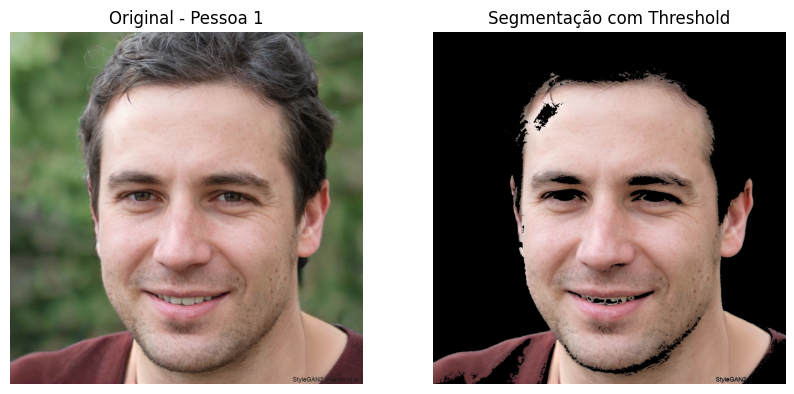 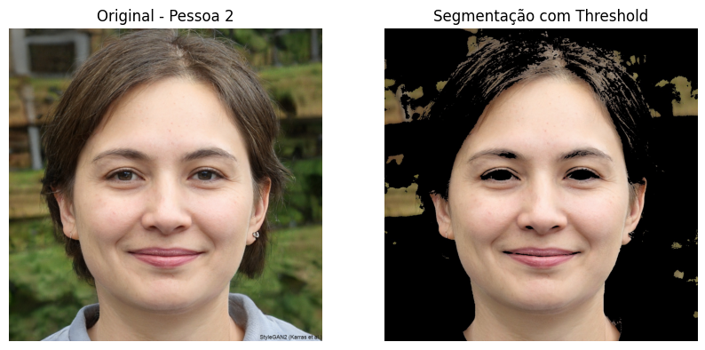 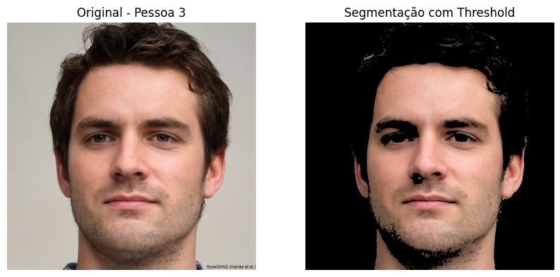 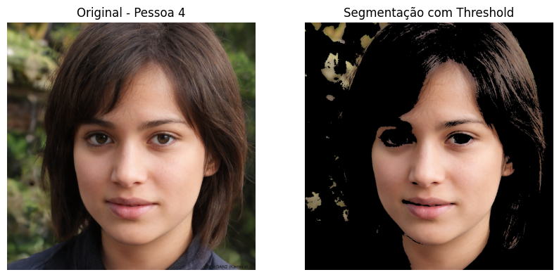 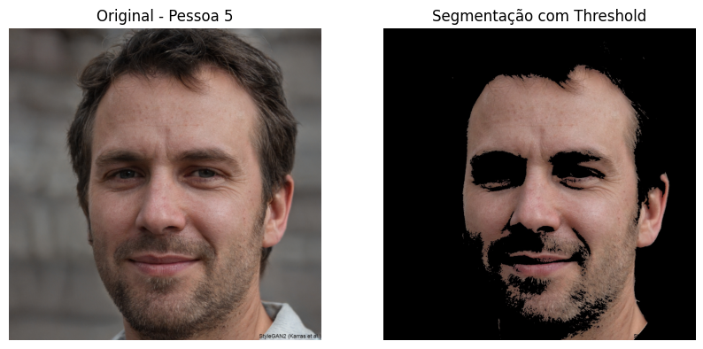 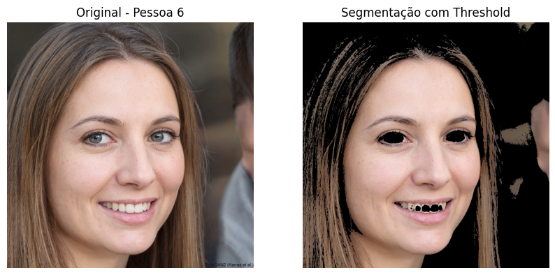

## Resultados K-means

Código K-means. Bom resultado quando a pessoa tem um bom contraste em relação ao fundo, nos demais, identifica o fundo como pixel válido.
Quantidade de clusters: 2.

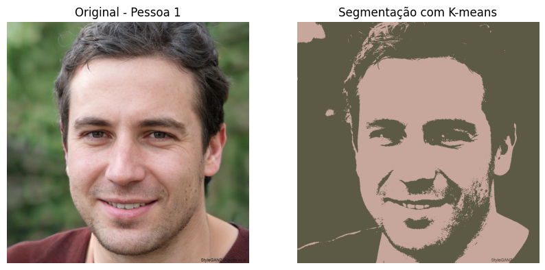 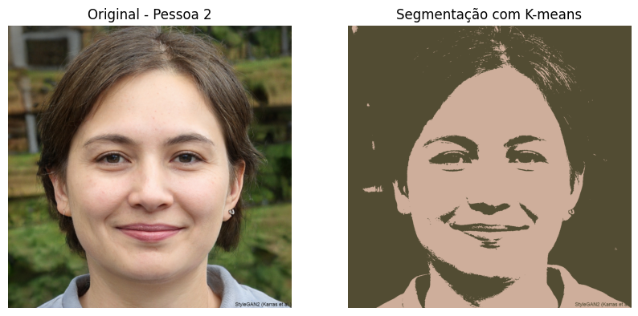 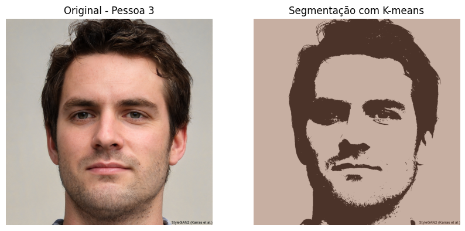 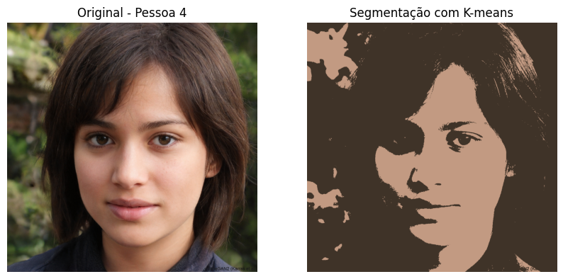 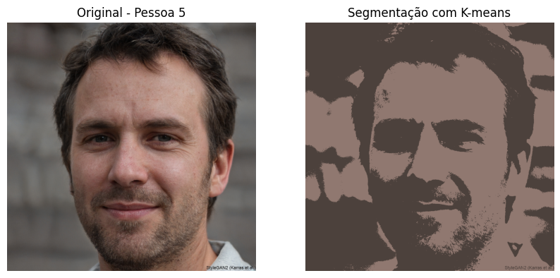 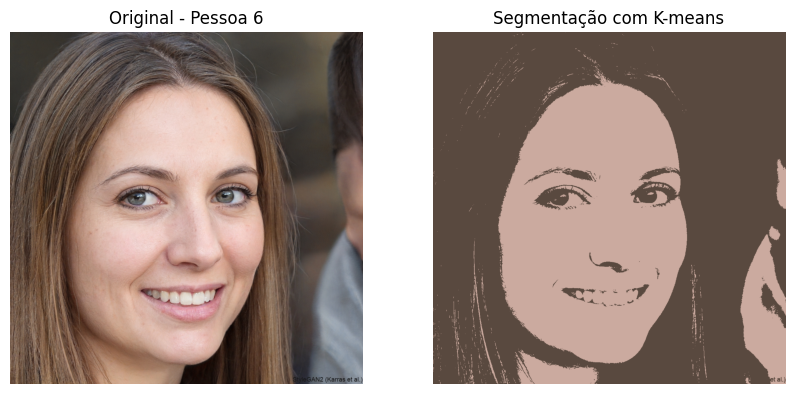

## Resultados Seeds

Código Seeds. Recorte muito bem definido, porém perde algumas partes da pele (colorização adicionada para melhor visualização).
num_superpixels=5, num_levels=6, prior=2, num_histogram_bins=6, num_iterations=1000.

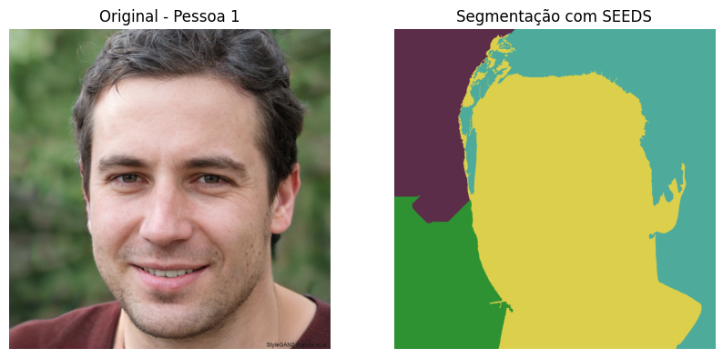 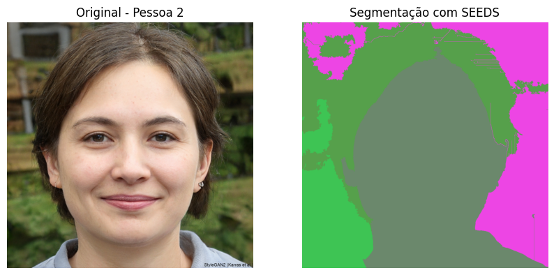 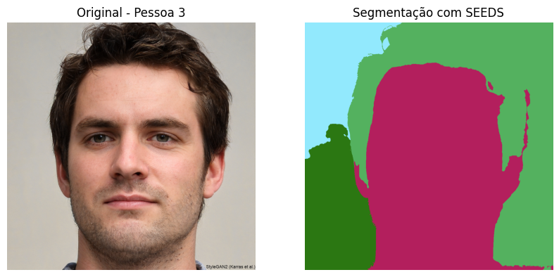 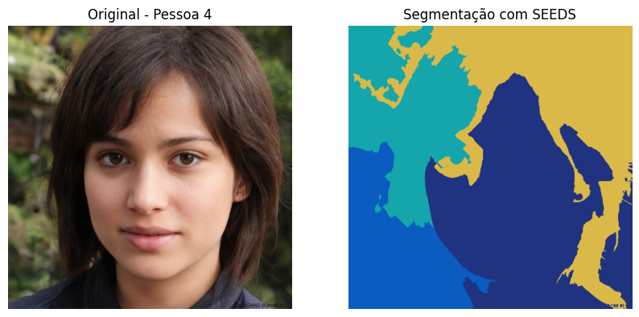 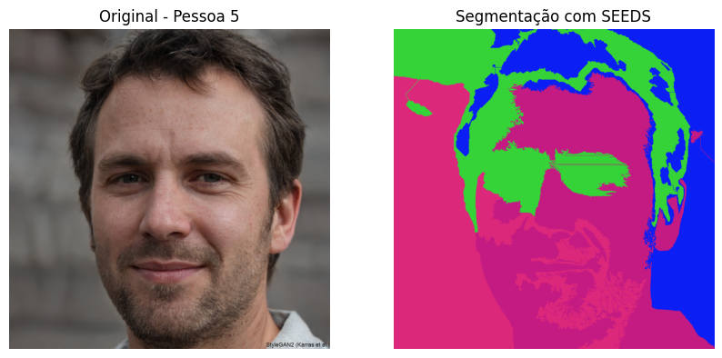 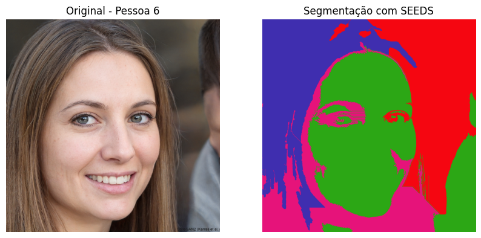

# Conclusão

Todos os códigos tiveram desempenhos parecidos, tendo carência de desempenho nos mesmos momentos e situações, porém de modo geral, todos eles fazem os recortes da pele, distinguindo bem onde é e não é um pixel válido. O Código K-means e Seeds, tem uma complexidade menor de implementação mas náo demonstram resultados tão favoráveis como o Thresholders no Skin Segmentation, sendo esse, em nossa percepção o trecho que gerou melhores resultados.